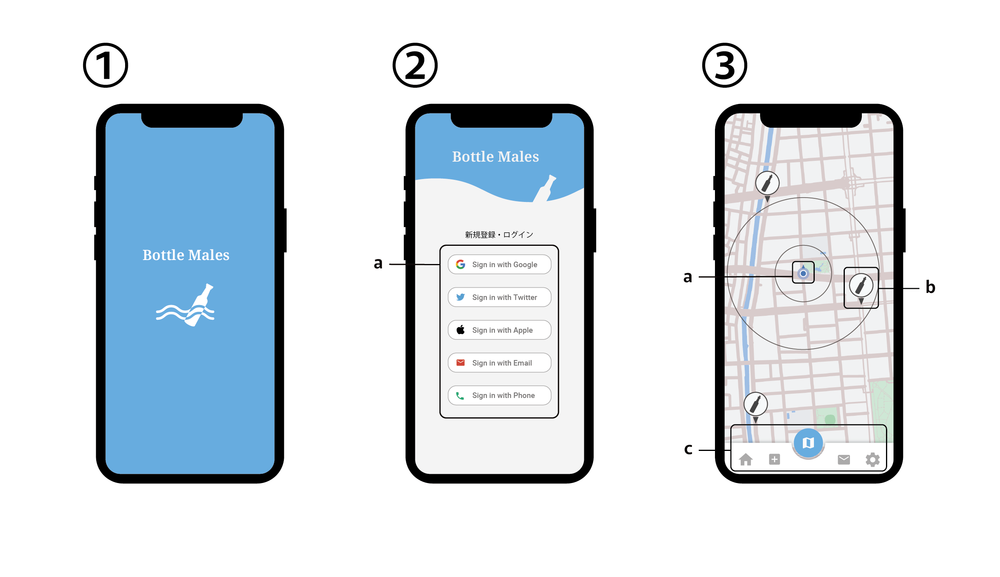
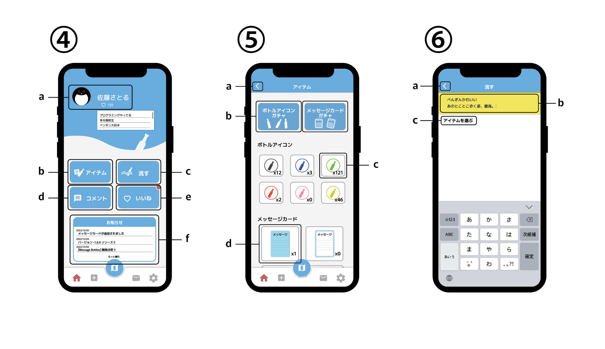
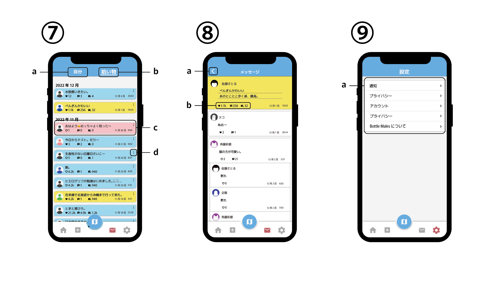

# 仕様書

## 画面イメージ

1. **ロード画面**  
2. **ログイン画面**  
   a. 新規登録・ログインボタン
3. **マップ画面(トップ)**  
   a. 現在位置  
   b. ボトル(メッセージ)位置
   c. アップバー
      - ホームボタン`=> ④`, 
      - 流す(投稿)ボタン`=> ⑥`, 
      - マップボタン`=> ③`, 
      - メッセージボタン`=> ⑦`, 
      - 設定ボタン`=> ⑨`, 
4. **ホーム画面**  
   a. アカウント情報(編集ボタン)  
   b. アイテムボタン`=> ⑤`  
   c. 流す(投稿)ボタン`=> ⑥`  
   d. コメント通知ボタン`=> コメント通知一覧`  
   e. いいね通知ボタン`=> いいね通知一覧`  
   f. お知らせ欄(ボタン)`=> お知らせ一覧`
5. **アイテム画面**  
   a. 戻るボタン`=> ④`  
   b. ガチャボタン  
   c. アイテム(ボトルアイコン)  
   d. アイテム(メッセージカード)  
6. **流す(投稿)画面**  
   a. 戻るボタン`=> ③or④`  
   b. メッセージ入力エリア  
   c. アイテム変更ボタン
7. **メッセージ一覧画面**  
   a. 自分ボタン(自分のメッセージを表示する)  
   b. 拾い物ボタン(拾ったメッセージを表示する)  
   c. メッセージ`=> ⑧`  
8. **メッセージ画面**  
   a. 戻るボタン`=> ⑦`  
   b. いいねボタン, メッセージボタン(可能な場合), リリースボタン
9. **設定画面**  
    a. 項目リスト
